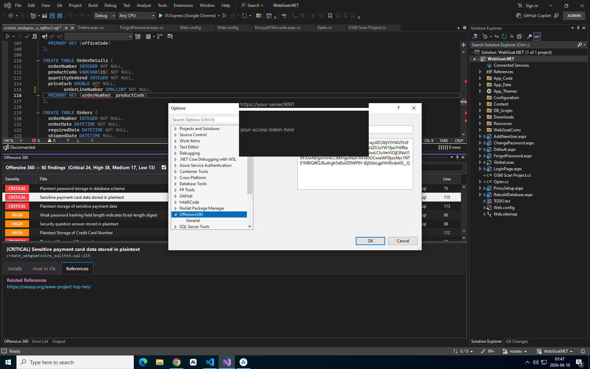
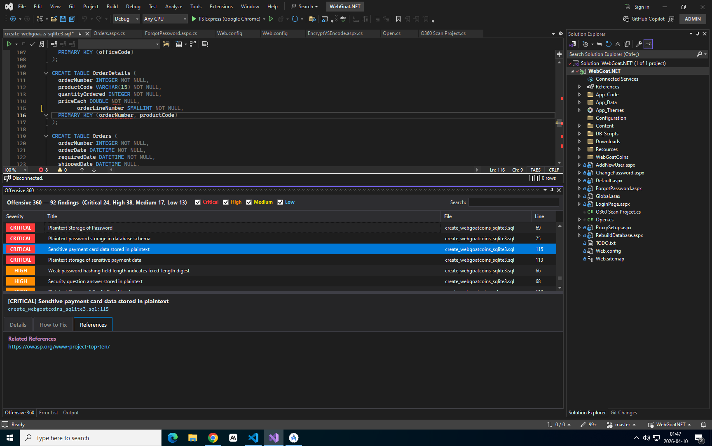
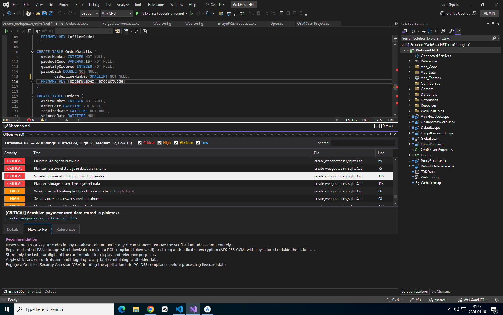
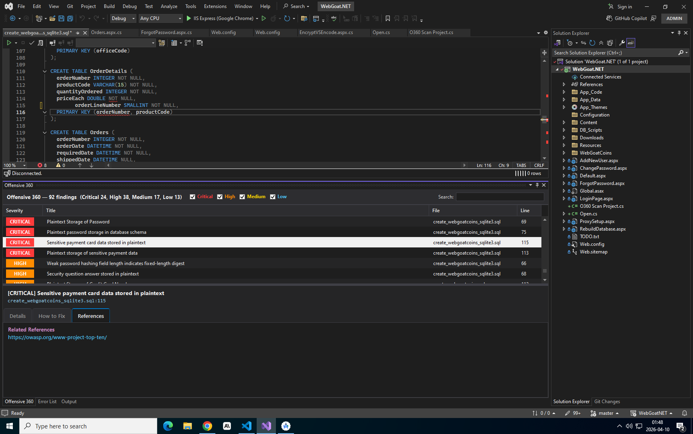

# Offensive 360 for Visual Studio

A deep source code analysis extension for Visual Studio that finds security vulnerabilities with a single click. Built on virtual compiler technology that understands your code at a structural level, catching flaws that go beyond surface-level pattern matching.

Supports Visual Studio 2022 (Community, Professional, and Enterprise).

---

## Features

- **One-click scanning** of entire solutions, individual projects, or single files
- **Dedicated findings panel** with severity filtering (Critical / High / Medium / Low) and search
- **Tabbed detail view** for each finding:
  - **Details** — full vulnerability description, impact analysis, and affected code snippet
  - **How to Fix** — step-by-step remediation guidance
  - **References** — links to OWASP, CWE, and related security resources
- **Click-to-navigate** — double-click any finding to jump straight to the vulnerable line
- **Smart caching** — rescans are instant when no files have changed (zero server traffic)
- **Automatic updates** — the plugin checks for new versions on each scan and notifies you when an update is available
- **Large project support** — handles projects up to 2GB with 4-hour upload timeout

---

## Installation

### From VSIX file

1. Download the latest `Offensive360.VSExt.vsix` from the [Releases](https://github.com/offensive360/VisualStudio/releases) page.
2. Close all Visual Studio instances.
3. Double-click the `.vsix` file and follow the installer prompts.
4. Reopen Visual Studio.

### From Visual Studio Marketplace

1. Open Visual Studio and go to **Extensions > Manage Extensions**.
2. Search for **Offensive 360**.
3. Click **Download** and restart Visual Studio when prompted.

---

## Configuration

Before scanning, you need to connect the plugin to your Offensive 360 server.

1. Go to **Tools > Options**.
2. Expand **Offensive360** in the left sidebar and click **General**.
3. Enter your **Base URL** (e.g. `https://your-server:9091`) and **Access Token**.
4. Click **OK**.

Your token and server URL are saved locally in your Visual Studio user profile and persist across restarts.

---

## How to Use

### Scanning

Open any .NET solution in Visual Studio, then:

- **Scan Solution**: Go to **Tools > Scan Solution with Offensive 360** (or use the Quick Launch search with `Ctrl+Q`)
- **Scan Project**: Right-click a project in Solution Explorer > **O360 SAST > Scan Project**
- **Scan File**: Right-click in the editor > **O360 SAST > Scan File**

The status bar at the bottom shows progress as the plugin zips your source, uploads it, and processes the results.

### Viewing Results

After a scan completes, the **Offensive 360** panel opens at the bottom of the IDE. It shows all findings in a sortable, filterable table.

**Details tab** — shows the vulnerability description, impact assessment, and the affected code snippet:

**How to Fix tab** — provides concrete remediation steps:

**References tab** — links to OWASP guidelines, CWE entries, and related documentation:

### Filtering

Use the severity checkboxes (Critical, High, Medium, Low) to filter findings by risk level. The search box filters across titles, file names, and descriptions.

### Navigation

Double-click any finding to open the source file and jump to the exact line and column. If the file can't be found (e.g. after renaming), a dialog explains what happened and suggests re-scanning.

---

## Caching and Performance

The plugin caches scan results locally. When you trigger a rescan and no files have changed, the cached results are loaded instantly with **zero server requests**. This is particularly useful for teams where multiple developers share a single Offensive 360 server.

The cache automatically invalidates when:
- Any source file in the solution is modified
- The plugin is updated to a new version

---

## Suppressing Findings

Right-click a finding in the Error List and select **Suppress** to add it to the project's ignore list (`.SASTO360/sastIgnore`). Suppressed findings won't appear in future scans. The ignore file can be committed to version control so the team shares the same suppressions.

---

## Requirements

- Visual Studio 2022 (version 17.0 or later)
- .NET Framework 4.5 or later
- An Offensive 360 server instance and a valid access token
- Network access to the server (HTTPS, self-signed certificates supported)

---

## Troubleshooting

| Issue | Solution |
|-------|----------|
| "No solution or folder is open" | Open a `.sln` file before scanning |
| Scan times out | Large projects (500MB+) may take several minutes to upload. Check your network connection. |
| "Access denied (HTTP 403)" | Your access token may be expired. Get a new one from your Offensive 360 administrator. |
| Settings page shows an error | Go to **Tools > Options > Offensive360 > General** and re-enter your credentials. |
| Findings not showing in the panel | Click the **Offensive 360** tab at the bottom of VS (next to Error List and Output). |

---

## Support

For issues and feature requests, please open an issue on this repository or contact your Offensive 360 administrator.

---

## License

Proprietary. See your Offensive 360 license agreement for terms.
