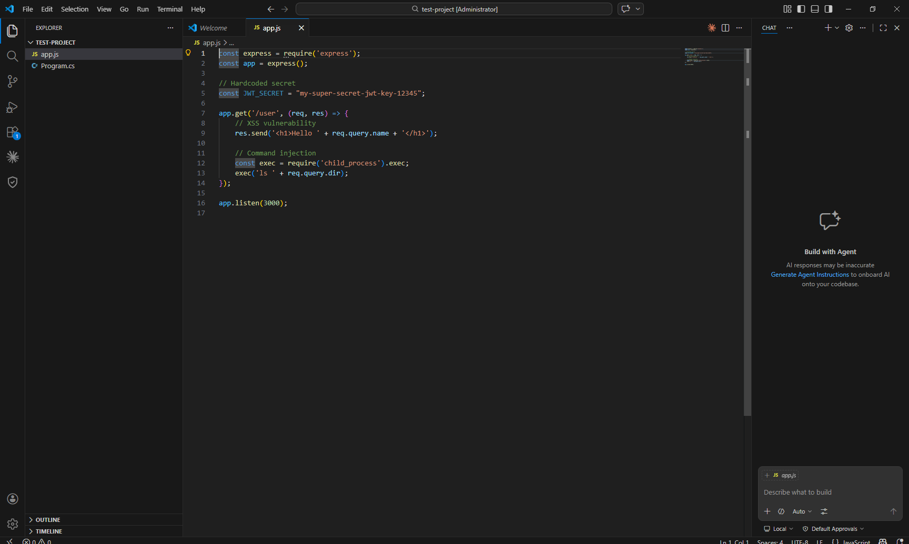
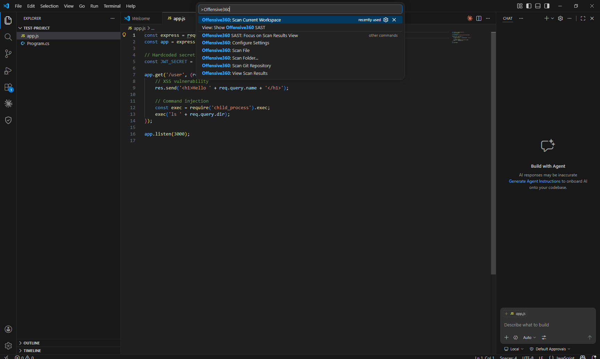
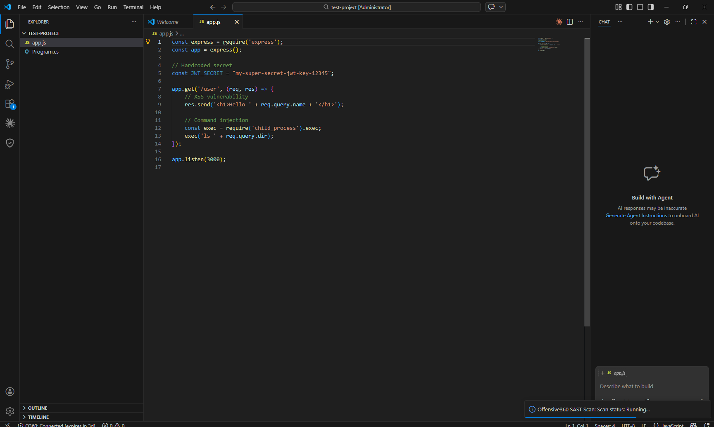
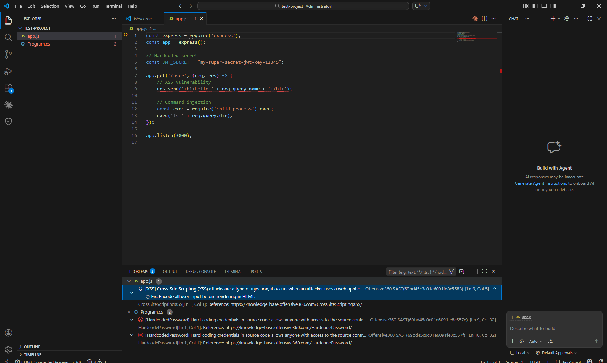

# Offensive360 SAST

**Enterprise Static Application Security Testing for VS Code**

Find and fix security vulnerabilities directly in your editor. O360 SAST uses deep source code analysis with proprietary virtual compilers to detect vulnerabilities, malware patterns, and insecure code across dozens of programming languages.

---

## Features

### Command Palette Integration

Quickly access all scanning commands from the VS Code Command Palette.

### Real-Time Scan Progress

Monitor scan progress directly within VS Code as your code is analyzed.

### Detailed Scan Results

View categorized vulnerability findings with severity levels, descriptions, and remediation guidance.

---

## Installation

1. Open VS Code
2. Go to the Extensions view (`Ctrl+Shift+X`)
3. Search for **Offensive360 SAST**
4. Click **Install**

## Configuration

After installation, configure the extension in VS Code Settings (`Ctrl+,`):

| Setting | Description |
|---------|-------------|
| `o360.endpoint` | Your O360 SAST server URL (e.g., `https://your-server.com:1800`) |
| `o360.accessToken` | API access token generated from your O360 dashboard under **Settings > Tokens** |

## Usage

Open the Command Palette (`Ctrl+Shift+P`) and run any of the following commands:

- **Offensive360: Scan Current Workspace** -- Scan all files in your workspace
- **Offensive360: Scan File** -- Scan the currently open file
- **Offensive360: Scan Folder** -- Scan a specific folder
- **Offensive360: Scan Git Repository** -- Scan a Git repository by URL

You can also right-click files or folders in the Explorer to scan them directly.

Results appear in the dedicated **Offensive360 SAST** sidebar panel with findings grouped by severity.

## Supported Languages

O360 SAST supports C#, Java, JavaScript, TypeScript, Python, PHP, Ruby, Go, Kotlin, Swift, Dart, C/C++, and many more.

For a full list of supported languages, visit [offensive360.com](https://offensive360.com).

---

## Links

- [Offensive360 Website](https://offensive360.com)
- [Report Issues](https://github.com/offensive360/VSCode/issues)

## License

MIT
